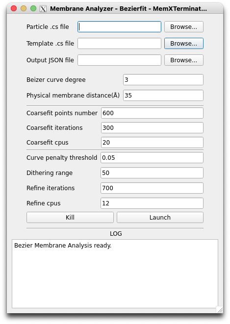

# Membrane Analysis Using Bezierfit

## 1 Principle and Approach

This method combines Monte Carlo methods, genetic algorithms, and Bezier curves to fit the biological membranes in 2D averages with **more complex and irregular curves as models**. The process results in several control points and their corresponding functional expressions. It's suitable for **more complex biological membrane models**, such as S-shaped or W-shaped membranes, like those of mitochondria.

Basic concept:

* For 2D averages dominated by membrane signals, a maximum value filter can extract the approximate area of the membrane;
* Using the Monte Carlo method, generate several random points $(i, j)$ based on grayscale values within the image;
* Employ genetic algorithms, using the aforementioned points $(i, j)$ as references, to fit a Bezier curve $L_1$, initially determining several control points $(x_n, y_n)$;
* Use genetic algorithms again, taking the initial control points $(x_n, y_n)$ as references, to adjust these points, so the fitted Bezier curve more closely aligns with the membrane signal in the 2D average;
* Obtain the optimal set of control points $(x'_n, y'_n)$ and the corresponding functional expression of the Bezier curve $L_2$. This curve describes the position of the membrane signal for this particular 2D average or class of particles.

## 2 Specific Operational Procedures

### 2.1 Enter Necessary File Paths

First, open the MemXTerminator main program, select the `Bezierfit` mode, then choose `Membrane Analyzer`, and enter the Membrane Analyzer interface:

In the interface, you need to enter the following file paths:

* `Particle .cs file`: Select the `.cs` file that saves all particles information, usually `particles_selected.cs`;
* `Template .cs file`: Select the `.cs` file that contains all templates information, usually `templates_selected.cs`;
* `Output JSON file`: Choose the JSON file to save all results, which contains control points information for all templates, typically `control_points.json`;

### 2.2 Set Appropriate Parameters for Analysis and Fitting

* `Bezier curve degree`: You can set the degree of the Bezier curve. Generally, a higher degree means a more complex curve, but it also increases the risk of overfitting. A 3rd degree Bezier curve, using 4 control points to determine the curve, is recommended;
* `Physical membrane distance`: Set the physical thickness of the biological membrane in Angstroms (Å). This parameter will be used to calculate the thickness of the mask for membrane averaging. It should be set based on actual conditions, generally between 35-40;
* `Coarsefit points number`: Set the number of points generated randomly by the Monte Carlo method. The default value of 600 should be sufficient;
* `Coarsefit iterations`: Set the number of iterations for the Monte Carlo method. The default value of 300 should be enough;
* `Coarsefit cpus`: As genetic algorithms are parallel, you can set multiple CPUs for computation. In the coarse fitting step, mainly CPU is used, so if you have more CPUs, it is advised to set a higher number to speed up computation, with a default value of 20;
* `Curve penalty threshold`: Since biological membranes are generally smooth curves with rare abrupt changes in curvature, you can set a curvature threshold to improve fitting accuracy. If the absolute value of curvature at any point of the generated curve exceeds this threshold, it will be penalized, thus reducing the likelihood of extreme curvature values. The default is 0.05;
* `Dithering range`: After coarse fitting, to enhance the reliability of refinement and avoid control point solutions getting trapped in local optima, you can set a dithering range. This means slightly perturbing the coordinates of each control point based on coarse fitting, to obtain a new starting point for refinement. The default value is 50, meaning each control point's coordinates will be randomly increased or decreased by a value within 50;
* `Refine iterations`: Set the number of iterations for refinement. The default value of 700;
* `Refine cpus`: As genetic algorithms are parallel, you can set multiple CPUs for computation. The refine process will use GPU, so if you have limited GPU memory, try not to use too many CPUs in parallel. The default is 12;

After setting the appropriate parameters, click `Launch` to start the analysis and fitting.

## 3 Results

You will obtain a `JSON` file containing `control_points` information for all templates. This `JSON` file can be used in the next step of Particles Membrane Subtraction.