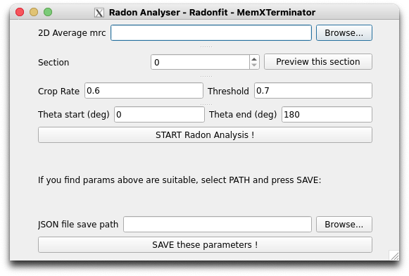
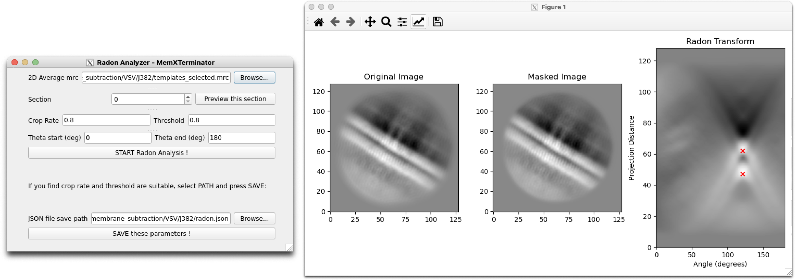
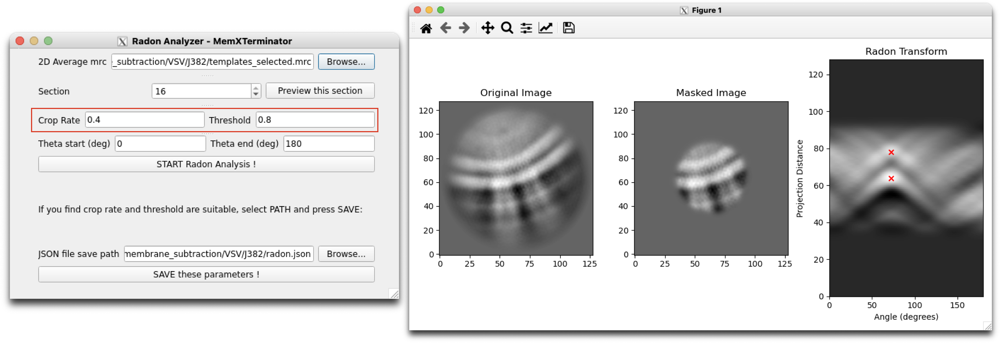
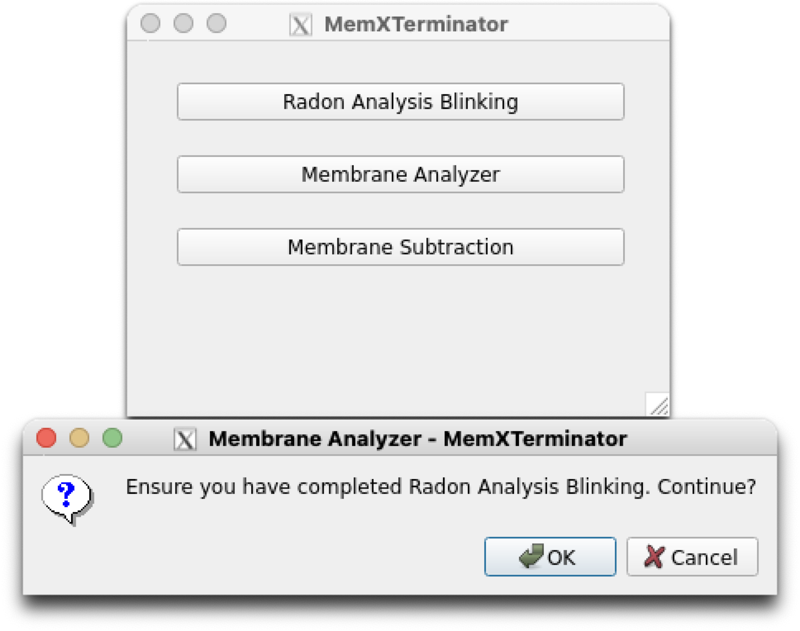
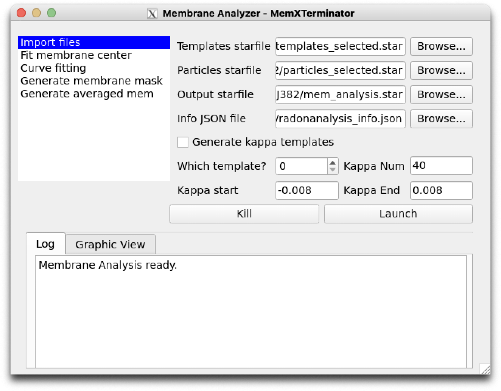
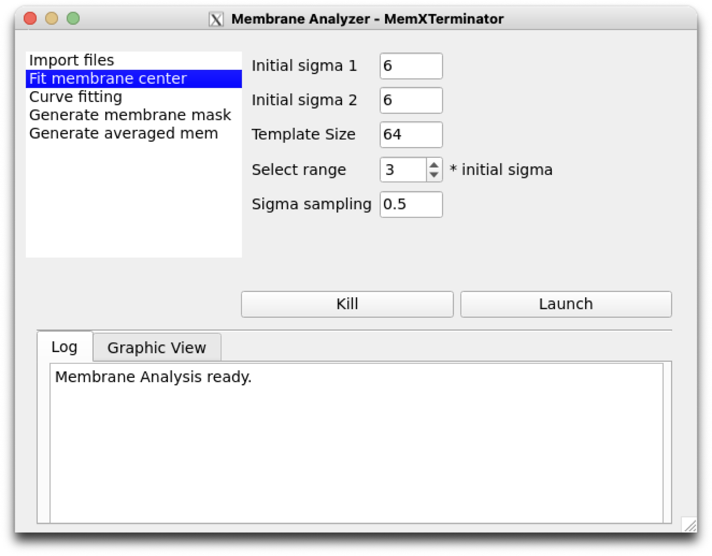
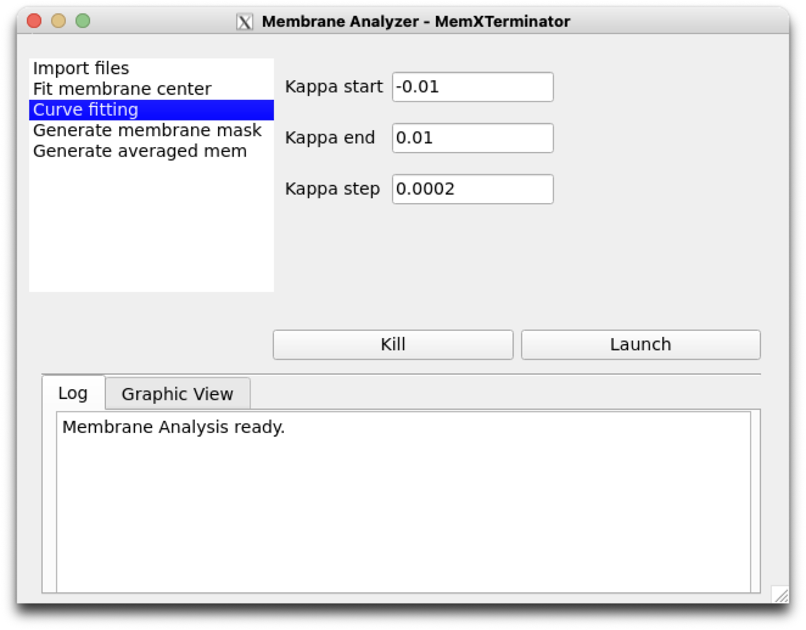
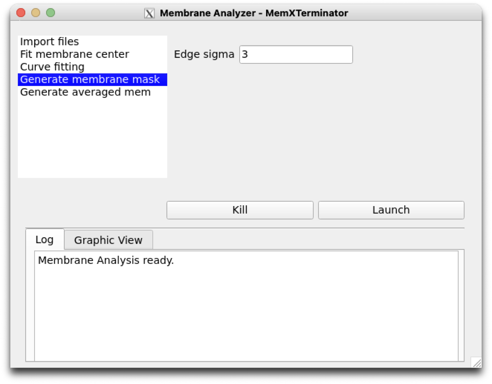
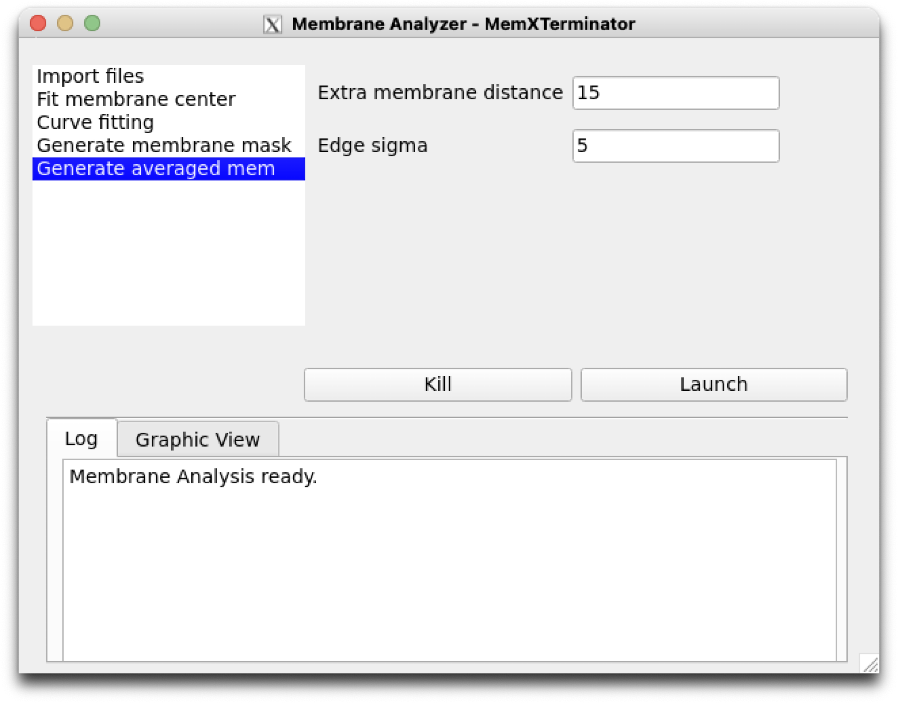

# Membrane Analysis Using Radonfit

## 1 Principle and Approach

This method primarily utilizes Radon transformation and cross-correlation, fitting 2D averages with **simple lines and arcs as models**, to derive functional expressions containing information such as the membrane center, angle, and curvature. It is suitable for **simpler biological membrane models**, like viral envelopes.

Basic Approach:

* Use Radon transformation to determine the rotation angle $\theta$ of the biological membrane and the spacing $d$ between the bilayers of the membrane;
* With the rotation angle $\theta$ known from the previous step, determine the tangential direction. In this direction, use a simulated membrane as a template to perform cross-correlation with the original 2D average, identifying the membrane's center position $(x_c, y_c)$;
* Once the precise location of the membrane center $(x_c, y_c)$ is determined, use cross-correlation at the center to match the optimal membrane thickness, i.e., the $\sigma_1$ and $\sigma_2$ values of the 2D Gaussian;
* Based on the previously determined rotation angle $\theta$, center position $(x_c, y_c)$, $\sigma_1$, and $\sigma_2$ values, and considering a range of curvatures $\kappa$, generate a series of simulated membranes and corresponding masks. Then, calculate the cross-correlation values with the original 2D average to determine the best curvature $\kappa$ value (where the cross-correlation value is the highest).
* With the derived $\kappa_{cur}, x_c, y_c, \sigma_1, \sigma_2, d, \theta$, the functional expression for that type of biological membrane can be established. For each original 2D average $f_{2DAverage}(x,y)$, this allows the calculation of the corresponding averaged biological membrane $f_{AveragedMembrane}(x,y)$ (abbreviated as $f_{AM}$) and the corresponding membrane mask $f_{MembraneMask}(x,y)$ (abbreviated as $f_{MM}$).

## 2 Specific Operational Procedures

### 2.1 Obtaining Templates and Corresponding Particles Information

Since the Radonfit program in this software still reads particle information in the Relion star file format, it is necessary to convert the particles' information from cryoSPARC into the Relion star file format. Future updates will consider reading `.cs` file information directly using cryosparc-tools.

1. Go to the folder corresponding to the cryoSPRAC Select 2D Classes job.

2. Use `pyem` `csparc2star.py` to run the following command, converting `templates_selected.cs` into `templates_selected.star`:

    For the latest version of `pyem`, run the following command:
    ```bash
    csparc2star.py --relion2 templates_selected.cs templates_selected.star
    ```

    If there is no relion2 parameter, it means your `pyem` version is older, run the following command:
    ```bash
    csparc2star.py templates_selected.cs templates_selected.star
    ```

3. Use `pyem`  `csparc2star.py` to run the following command, converting `particles_selected.cs` into `particles_selected.star`:
    For the latest version of `pyem`, run the following command:
    ```bash
    csparc2star.py --relion2 particles_selected.cs Jxxx_passthrough_particles_selected.cs particles_selected.star
    ```
    If there is no relion2 parameter, it means your `pyem` version is older, run the following command:
    ```bash
    csparc2star.py --swapxy particles_selected.cs Jxxx_passthrough_particles_selected.cs particles_selected.star
    ```

### 2.2 Radon Analysis Blinking

1. First, open the MemXTerminator main program and enter the Radon Analysis Blinking interface:
    <center></center>

2. Select the mrc file of the 2D average you wish to analyze. Entering Section allows for previewing different sections;

3. Fill in a suitable JSON file save path: click Browse, choose a folder, then enter a JSON file name in that folder, such as `radon_analysis.json`. This JSON file will be used to save the parameters obtained from Radon Analysis Blinking, which you can use in the next step of Membrane Analysis.
    > Once you enter a JSON file name, the software will automatically create a corresponding JSON file and fill in default parameters: `crop rate` of 0.6, `threshold` of 0.7, `theta_start` of 0, and `theta_end` of 180.

3

. Choose an appropriate crop rate and threshold, then click START Radon Analysis to begin the analysis;

4. Continuously adjust the Crop rate and threshold until obtaining suitable Radon Analysis results. Typical Radon Analysis results usually conform to: selecting two points in the Radon Transform image, represented by red crosses, where their x-coordinates are the same or nearly the same (as generally, the bilayers in a 2D average are parallel), and their y-coordinate spacing is the same or nearly the same as the bilayer spacing. Below are two examples:

    <center></center>

    <center></center>

    > Note: When adjusting parameters, ideally these parameters can always be optimized to successfully analyze the results. If you find that no matter what, you can't analyze suitable results, it means that this 2D average may not be suitable for analysis using Radonfit. Exclude these types of 2D averages.

5. Once you obtain suitable Radon Analysis results, click SAVE these parameters to save the parameters to a JSON file, which will be used in the next step of Membrane Analysis.

### 2.3 Membrane Analysis

1. Open the MemXTerminator main program and enter the Membrane Analyzer interface:
    <center></center>

2. Click on Import files and sequentially input the previously obtained `templates_selected.star`, `particles_selected.star`, specify the path to save the results of the Membrane analysis parameters, and then input the JSON file of the previous Radon Analysis results. Remember not to check `Generate kappa templates`.
    <center></center>

3. Click on Fit membrane center to set parameters related to the step of searching for the membrane center. Default parameters are generally applicable.
    <center></center>
    The parameters are explained as follows:

    * `Initial sigma 1`: Initial value of $\sigma_1$, the Gaussian distribution sigma for one side of the lipid monolayer, denoted as $\sigma_{init_1}$;
    * `Initial sigma 2`: Initial value of $\sigma_2$, the Gaussian distribution sigma for the other side of the lipid monolayer, denoted as $\sigma_{init_2}$;
    * `Template Size`: The size of the template used for cross-correlation, usually does not need to be changed;
    * `Select range`: The search range for both $\sigma$ values, which can be set as a multiple $x$ of $\sigma_{init_1}$ and $\sigma_{init_2}$, ranging from $[0.1, x \times \sigma_{init_1})$ and $[0.1, x \times \sigma_{init_2})$.
    * `Sigma sampling`: The sampling interval for $\sigma$ values, usually does not need to be changed. A smaller interval can be used for more precise matching of membrane thickness, but this increases computational load.

4. Click on Curve fitting to set parameters related to the step of searching for membrane curvature. Default parameters are generally applicable.
    <center></center>
    The parameters are explained as follows:

    * `Kappa start`: The starting value for curvature search, default is -0.1, usually the default is sufficient;
    * `Kappa end`: The ending value for curvature search, default is 0.1, usually the default is sufficient;
    * `Kappa step`: The step length for curvature search, default is 0.0002, usually the default is sufficient. If increased precision is desired, the step length can be reduced, but this will increase computational load.

5. Click on Generate membrane mask to set parameters related to the step of generating a membrane mask. Default parameters are generally applicable.
    <center></center>
    The parameters are explained as follows:

    * `Edge sigma`: The sigma value for edge blurring, default is 3, usually the default is sufficient.

6. Click on Generate averaged mem to set parameters related to the step of generating an averaged membrane. Default parameters are generally applicable.
    <center></center>
    The parameters are explained as follows:

    * `Extra membrane distance`: Extra range added on both sides during averaging along the curve, so the actual averaging range is $[-d_{extra}-d_{mem}, d_{mem}+d_{extra}]$, aimed at ensuring membrane completeness and reducing edge effects. Default is 15, usually the default is sufficient.

    * `Edge sigma`: The sigma value for edge blurring, default is 5, usually the default is sufficient.

7. After reviewing and modifying the parameters, click Launch to start the analysis. Upon completion, a `mem_analysis.star` file containing all analysis results will be generated in your specified save path.

## 3 Results

You will find the `mem_analysis.star` file in your specified save path, containing all the analysis results. Below is the content of a typical `mem_analysis.star` file:

1. `rln2DAverageimageName`: The mrc file name of the 2D average;
2. `rlnAveragedMembraneName`: The mrc file name of the averaged membrane of the 2D average;
3. `rlnMembraneMaskName`: The mrc file name of the membrane mask corresponding to the 2D average;
4. `rlnCenterX`: The x-coordinate of the membrane center in the 2D average;
5. `rlnCenterY`: The y-coordinate of the membrane center

 in the 2D average;
6. `rlnAngleTheta`: The rotation angle of the membrane;
7. `rlnMembraneDistance`: The distance between the lipid bilayers;
8. `rlnSigma1`: The $\sigma_1$ value of the Gaussian distribution of one side of the lipid monolayer;
9. `rlnSigma2`: The $\sigma_2$ value of the Gaussian distribution of the other side of the lipid monolayer;
10. `rlnCurveKappa`: The curvature of the membrane.
