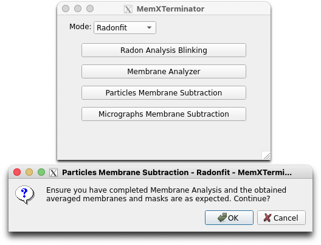
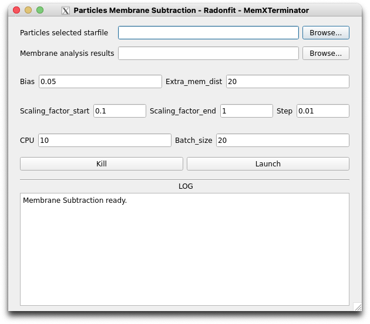

# Particle Membrane Subtraction Using Radonfit

## 1 Principle and Approach

After completing the previous step of Membrane Analysis Using Radonfit, you have obtained a file `mem_analysis.star` containing all analysis results, including membrane center coordinates, angles, membrane curvature, and more. In this step, you will use this information to subtract membrane signals from all particles.

Basic concept:

* For each particle $F_{RawImage}(x,y)$ (abbreviated as $F_{RI}(x,y)$), corresponding to its template $f_{2DAverage}(x,y)$, we have a membrane-averaged function $f_{AveragedMembrane}(x,y)$ (abbreviated as $f_{AM}$) and a corresponding membrane mask $f_{MembraneMask}(x,y)$ (abbreviated as $f_{MM}$);
* Based on alignment information from cryoSPARC, i.e., the previously used `particles_selected.star` file, we can determine the displacement $(\Delta x, \Delta y)$ and rotation angle $\psi$ for each particle. Using these parameters, transform $f_{AM}$ and $f_{MM}$ accordingly to match each particle's membrane signal, resulting in transformed functions $f'_{AM}$ and $f'_{MM}$;
* For each particle, perform trajectory averaging using $f'_{AM}$ and $f'_{MM}$, thereby obtaining each particle's corresponding membrane signal $F_{AM}(x,y)$ and mask $F_{MM}(x,y)$;
* For each particle, to obtain $F_{SubtractedRawImage}(x,y)$ (abbreviated as $F_{SRI}(x,y)$), use the following equation:

$$
F_{SRI}(x,y) = F_{RI}(x,y) \times F_{MM}(x,y) - \lambda \times F_{AM}(x,y)
$$

where $\lambda$ is a constant controlling the intensity of membrane subtraction. $\lambda$ is determined by:

$$
\lambda = \arg \min_{\lambda} || F_{RI}(x,y) \times F_{MM}(x,y) - \lambda \times F_{AM}(x,y) ||
$$

## 2 Specific Operational Procedures

### 2.1 Open Particles Membrane Subtraction Interface

First, open the MemXTerminator main program, select the `Radonfit` mode, then choose `Particles Membrane Subtraction`, and enter the Particles Membrane Subtraction interface:

### 2.2 File Path Entry and Parameter Explanation

In the Particles Membrane Subtraction interface:

You need to enter the following file paths:

* `Particles selected starfile`: Choose the star file that saves all particles information, usually `particles_selected.star`;

* `Membrane analysis results`: Choose the star file that contains all membrane analysis information, usually `mem_analysis.star`;

In the interface, you can set the following parameters:

* `Bias`: During membrane signal subtraction, you can set a bias value to manually adjust the strength of membrane signal removal. The actual membrane subtraction intensity $\lambda' = \lambda + \text{bias}$. Default is 0.05;

* `Extra_mem_dist`: When performing trajectory averaging, you can set an extra membrane thickness, which adds an additional thickness to the membrane to increase the stability of the subtraction effect. Default is 15;

* `Scaling_factor_start` and `Scaling_factor_end`: The search range for the scaling factor (i.e., $\lambda$) during trajectory averaging. Default is between 0.1 and 1;

* `Scaling_factor_step`: The search step for the scaling factor (i.e., $\lambda$) during trajectory averaging. Default is 0.01. A smaller step size may result in more accurate determination of the scaling factor but increases computation time;

* `CPU`: You can set multiple CPUs for computation. Default is 10. However, if your GPU memory is limited, it is advised not to set too many CPUs to avoid memory issues;

* `Batch_size`: You can set how many particle stacks are processed in parallel. Default is 20, twice the number of CPUs. It is recommended to set it as a multiple of the CPU number. If your GPU memory is limited, it is advised not to set a large Batch size.

After setting the appropriate parameters, click `Launch` to begin the membrane signal subtraction.

## 3 Results

After the run, you will find a subtracted folder next to the folder where you extracted the particles, like this:

    Jxxx/
    ├── extract/
    ├── subtracted/

In the subtracted folder, you will find all the mrc files of the particles with

 membrane signals removed. You can proceed with further processing using cryoSPARC or reattach the particles to the micrographs for subsequent processing.