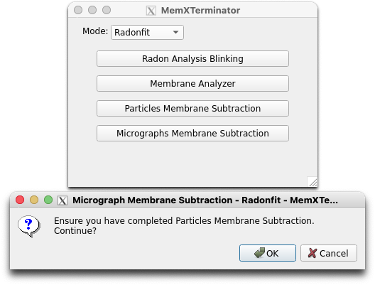
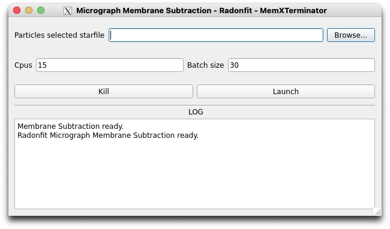

# Micrograph Membrane Subtraction

## 1 Principle and Approach

After the previous step of removing membrane signals from all particles, you can "re-stick" these subtracted particles back into the original micrograph to obtain a micrograph with the membrane signals removed. This micrograph can be used for subsequent processing.

Basic concept:

* For each particle $F_{RI}(x,y)$, we have a particle with membrane signals removed, $F_{SRI}(x,y)$;

* Based on the positional information of particles provided by cryoSPARC, we can replace the original particle $F_{MI}(x,y)$ in the micrograph with $F_{SRI}(x,y)$ to obtain a micrograph with membrane signals removed;

* Of course, during the replacement process, considerations should be given to ensuring that $F_{SRI}(x,y)$ is at the same scale as the original $F_{RI}(x,y)$ and to how to handle overlapping areas in the stitching process, among other factors.

## 2 Specific Operational Procedures

### 2.1 Open Micrograph Membrane Subtraction Interface

First, open the MemXTerminator main program, select the `Radonfit` mode, then choose `Micrograph Membrane Subtraction`, and enter the Micrograph Membrane Subtraction interface:

### 2.2 File Path Entry and Parameter Explanation

The Micrograph Membrane Subtraction interface is as follows:

In the interface, you need to enter the following file path:

* `Particles selected starfile`: Choose the star file that saves all particles information, usually `particles_selected.star`;

In the interface, you can set the following parameters:

* `Cpus`: You can set multiple CPUs for computation. Default is 15. However, if your GPU memory is limited, it is advised not to set too many CPUs to avoid memory issues;

* `Batch_size`: You can set how many micrographs are processed in parallel. Default is 30, twice the number of CPUs. It is recommended to set it as a multiple of the CPU number. If your GPU memory is limited, it is advised not to set a large Batch size.

After setting the appropriate parameters, click `Launch` to begin the membrane signal removal from the micrograph.

## 3 Results

After the run, you will find a subtracted folder next to your folder containing the motion-corrected micrographs, like this:

    Sxxx/
    ├── motioncorrected/
    ├── subtracted/

In the subtracted folder, you will find all the mrc files of the micrographs with membrane signals removed. You can proceed with further processing using cryoSPARC.