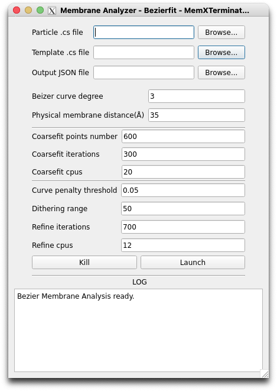

# Membrane Analysis Using Bezierfit

## 1 原理及思路

这种方法主要结合了蒙特卡洛方法、遗传算法等方法的贝塞尔曲线来对2D average中的生物膜进行拟合，以**更加复杂的不规则曲线为模型**，拟合2D average，得到若干个控制点以及对应的函数解析式。适用于**形状较为复杂的生物膜模型**，例如S型、W型等，比如线粒体膜。

基本思路：

* 对于膜信号占主导的2D average，使用最大值滤波器可以提取出膜的大致区域；
* 使用蒙特卡洛方法，按照灰度值在图像中随机生成若干个点$(i, j)$；
* 使用遗传算法，以上述若干点$(i, j)$为参考，拟合出一条贝塞尔曲线$L_1$，初步确定若干个控制点$(x_n, y_n)$；
* 使用遗传算法，以上述若干个控制点$(x_n, y_n)$为参考，调整这些控制点，使得拟合出的贝塞尔曲线与2D average的膜信号更加吻合；
* 得到最优的若干个控制点$(x'_n, y'_n)$，以及对应的贝塞尔曲线的解析式$L_2$。这个曲线就描述了这一个2D average，或者说这一类particles的膜信号的位置。

## 2 具体操作流程

### 2.1 填入必要的文件路径

首先，打开MemXTerminator主程序，选择`Bezierfit`模式，再选择`Membrane Analyzer`，进入Membrane Analyzer界面：

在界面中，您需要填入以下文件路径：

* `Particle .cs file`：您需要选择用于保存所有的particles信息的`.cs`文件，通常为`particles_selected.cs`；
* `Template .cs file`：您需要选择保存所有的templates信息的`.cs`文件，通常为`tmeplates_selected.cs`；
* `Output JSON file`：您需要选择保存所有的结果的JSON文件，这个JSON文件保存了所有的templates对应的control_points信息，通常为`control_points.json`；

### 2.2 设置合适参数进行分析拟合

* `Bezier curve degree`：您可以设置贝塞尔曲线的阶数，一般而言，阶数越高，拟合的曲线越复杂，但是也越容易出现过拟合的情况。建议您使用3阶贝塞尔曲线，即使用4个控制点确定曲线；
* `Physical membrane distance`：您可以设置生物膜的物理厚度，单位为$\AA$，这个参数将用于计算蒙版的厚度用于膜的平均，建议按照实际情况填写，一般为35-40之间的值；
* `Coarsefit points number`：您可以设置蒙特卡洛方法中随机生成的点的数量，默认值600应该没有问题；
* `Coarsefit iterations`：您可以设置蒙特卡洛方法中的迭代次数，默认值300应该已经足够；
* `Coarsefit cpus`：由于遗传算法为并行算法，您可以设置使用多个CPU进行计算。在粗拟合这一步中，主要是利用CPU进行计算，因此如果您计算机的CPU数量较多，建议设置较大的值，可以加快计算速度，默认值为20；
* `Curve penalty threshold`：由于生物膜一般都是比较光滑的曲线，很少出现曲率突变的情况。为了提升拟合的准确性，您可以根据实际数据的情况，设置一个曲率的阈值，当生成的曲线中某一处的曲率的绝对值超过这个阈值时，将会被惩罚，从而降低曲率的绝对值出现离谱值的情况。默认为0.05；
* `Dithering range`：在完成粗拟合后，为了提升refine的可靠性，避免控制点解陷入局部最优解，您可以设置一个dithering range，即在粗拟合的基础上，对每一个控制点的坐标进行微小的扰动，从而得到一个新的控制点，这个新的控制点将作为refine的初始值。默认值为50，即每个控制点的坐标将在原来的基础上，随机增加或者减少50以内的某个值；
* `Refine iterations`：您可以设置refine的迭代次数，默认值为700；
* `Refine cpus`：由于遗传算法为并行算法，您可以设置使用多个CPU进行计算。在refine过程中会使用GPU，如果显存不是很大，尽量不要使用太多CPU并行。默认为12；

设置完合适参数后，点击`Launch`即可开始分析拟合。

## 3 结果

您可以得到一个`JSON`文件，其中包含了所有的templates对应的`control_points`信息。您可以在下一步Particles Membrane Subtraction中使用这个`JSON`文件。