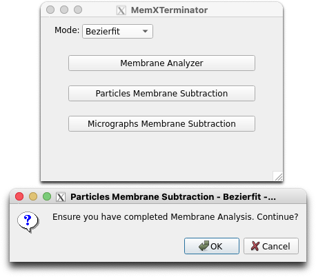
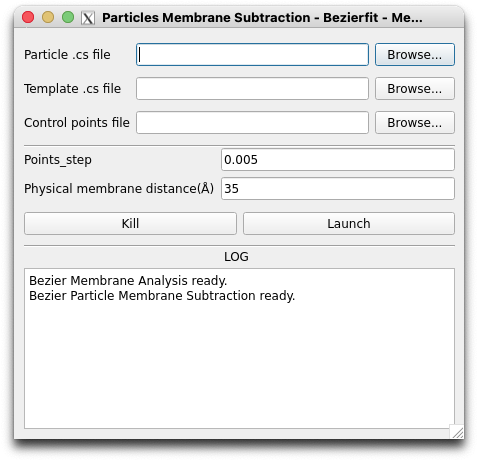

# Particles Membrane Subtraction Using Bezierfit

## 1 原理及思路

在经过上一步Membrane Analysis Using Bezierfit后，您已经得到了所有templates对应的control_points信息，相当于就是得到了对应的贝塞尔曲线的解析式。在这一步中，您将使用这些信息，去除所有particles中的膜信号。

基本思路：

* 对每一个particle $F_{RawImage}(x,y)$ （简称$F_{RI}(x,y)$，根据其对应的template $f_{2DAverage}(x,y)$ ，得到其对应的control_points信息 $(x'_n, y'_n)$ ；
* 根据cryoSPARC给出的alignment信息，也就是`particles_selected.cs`文件，可以得到对于每一个particle的位移量 $(\Delta x, \Delta y)$ 以及旋转角度 $\psi$ ，利用这些信息，将control_points $(x'_n, y'_n)$ 信息进行相应的变换，得到每一个particle的膜信号对应的控制点 $(x''_n, y''_n)$ 以及贝塞尔曲线 $L_3$ ；
* 根据得到的贝塞尔曲线 $L_3$ ，可以得到每个particle对应的蒙版 $F_{MembraneMask}(x,y)$ （简称$F_{MM}(x,y)$）以及对应的在蒙版内平均后的生物膜 $F_{AveragedMembrane}(x,y)$ （简称$F_{AM}(x,y)$）；
* 对于每个particle，要得到$F_{SubtractedRawImage}(x,y)$ （简称$F_{SRI}(x,y)$）都有：

$$
F_{SRI}(x,y) = F_{RI}(x,y) \times F_{MM}(x,y) - \lambda \times F_{AM}(x,y)
$$

其中 $\lambda$ 为一个常数，用于控制去膜的强度。确定 $\lambda$ 的方法是：

$$
\lambda = argmin_{\lambda} || F_{RI}(x,y) \times F_{MM}(x,y) - \lambda \times F_{AM}(x,y) ||

$$

## 2 具体操作流程

### 2.1 打开Particles Membrane Subtraction界面

首先，打开MemXTerminator主程序，选择`Bezierfit`模式，再选择`Particles Membrane Subtraction`，进入Particles Membrane Subtraction界面：

### 2.2 文件路径填写和参数解释

以下为Particles Membrane Subtraction界面：

在界面中，您需要填入以下文件路径：

* `Particle .cs file`：您需要选择用于保存所有的particles信息的`.cs`文件，通常为`particles_selected.cs`；
* `Template .cs file`：您需要选择保存所有的templates信息的`.cs`文件，通常为`tmeplates_selected.cs`；
* `Control points JSON file`：您需要选择保存所有的control_points信息的JSON文件，这个JSON文件保存了所有的templates对应的control_points信息，通常为`control_points.json`；

在界面可以选择设置这些参数：

* `Points_step`：由于贝塞尔曲线是用若干点近似的，因此您可以设置生成时这些点的间距，以此控制生成的贝塞尔曲线的精度。如果您设置的值较小，生成的贝塞尔曲线将更加精细，但是也会增加计算量；如果您设置的值过大，可能会影响Membrane Subtraction的效果。默认为0.005；
* `Physical membrane distance`：您可以设置生物膜的物理厚度，单位为$\AA$，这个参数将用于计算蒙版的厚度用于膜的平均，建议按照实际情况填写，一般为35-40之间的值；

设置完合适参数后，点击`Launch`即可开始去膜。

## 3 结果

您将在您extract出的particles的文件夹旁边得到一个subtracted文件夹，即：

    Jxxx
    ├── extract
    ├── subtracted

其中包含了所有的去膜后的particles的mrc文件。您可以使用cryoSPARC进行下一步的处理，或者将particles重新贴回micrographs中进行下一步处理。