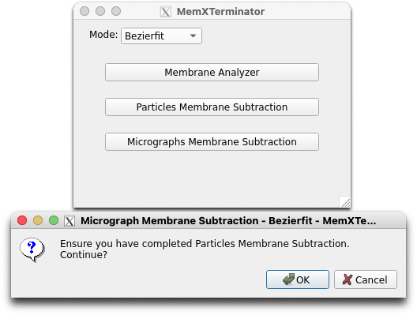
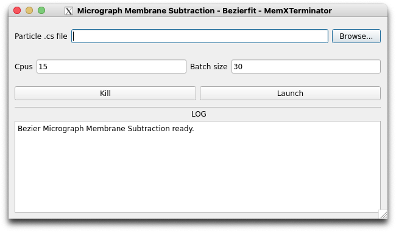

# Micrograph Membrane Subtraction

## 1 原理及思路

经过上一步得到所有去除完膜信号的particles后，您可以将这些subtracted particles重新“贴回”原来的micrograph中，得到一个去除完膜信号的micrograph。这个micrograph可以用于后续处理。

基本思路：

* 对于每一个particle $F_{RI}(x,y)$ ，我们都有去除膜信号的particle $F_{SRI}(x,y)$ ；

* 根据cryoSPARC给出的particle的位置信息，我们可以用 $F_{SRI}(x,y)$ 替换掉原来micrograph中的particle $F_{MI}(x,y)$ ，得到去除完膜信号的micrograph；

* 当然，在替换过程中也需要考虑到：比如 $F_{SRI}(x,y)$ 要和原本的 $F_{RI}(x,y)$ 处于同一scale，也要考虑在拼接过程中重叠部分如何处理等等。

## 2 具体操作流程

### 2.1 打开Micrograph Membrane Subtraction界面

首先，打开MemXTerminator主程序，选择`Bezierfit`模式，再选择`Micrographs Membrane Subtraction`，进入Micrograph Membrane Subtraction界面：

### 2.2 文件路径填写和参数解释

以下为Micrograph Membrane Subtraction界面：

在界面中，您需要填入以下文件路径：

* `Particles .cs file`：目前暂不支持`.cs`文件。您需要使用`pyem`将`particles_selected.cs`文件转换成`particles_selected.star`文件，选择用于保存所有的particles信息的star文件，通常为`particles_selected.star`；

在界面可以选择设置这些参数：

* `Cpus`：您可以设置多个CPU进行计算。默认为15。但是如果您的显存较小，建议不要设置太多CPU，否则可能会出现显存不足的情况；

* `Batch_size`：您可以设置并行处理多少个micrographs。默认为30，即CPU数量的2倍。设置为CPU数量的倍数比较好。如果您的显存较小，不建议设置太大的Batch size。

设置完合适参数后，点击`Launch`即可开始对micrograph去除膜信号。

## 3 结果

运行结束后，您将在您保存micrographs的文件夹motioncorrected旁边得到一个subtracted文件夹，即：

    Sxxx
    ├── motioncorrected
    ├── subtracted

在subtracted文件夹中，保存有所有去除膜信号后的micrographs的mrc文件。您可以使用cryoSPARC进行下一步的处理。