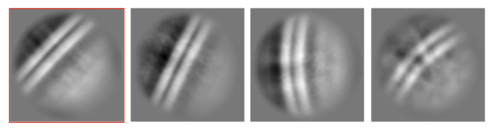
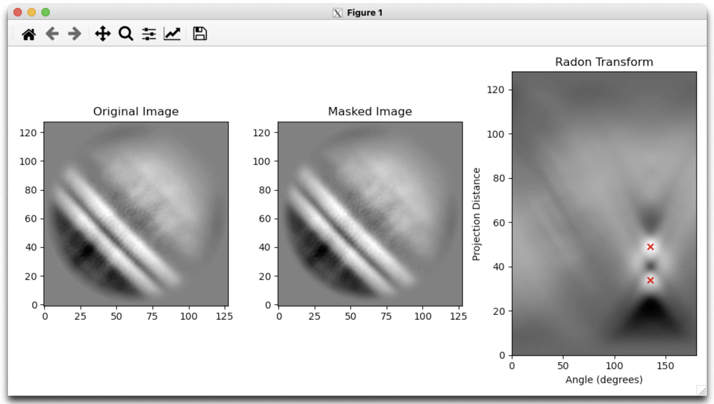
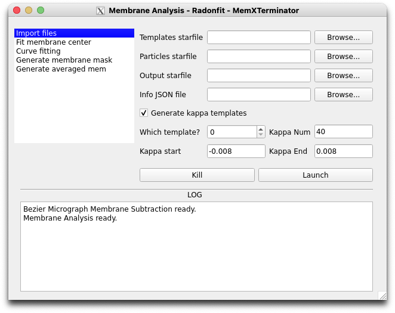
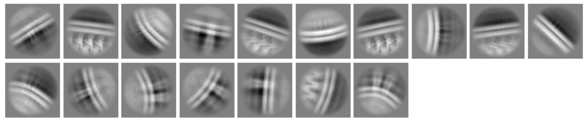

# Obtain 2D Averages

## 1 原理及思路
使用一系列曲率不同、且其中心都在图像中心的生物膜作为模版pick particles，得到的相应particles的中心就能够落在micrographs中的生物膜的中心。然后对这些particles进行2D classification，得到的2D averages都是生物膜中心位于图像中心的2D averages。

这样做的好处在于，之后进行膜的分析拟合会变得简单并且更加准确。

## 2 具体操作流程

### 2.1 在cryoSPARC中获取2D average

首先我们需要在cryoSPARC中获取一个2D average，这个2D average中的生物膜信号较强，且信噪比较高。因为本方法就是想要减弱膜信号，所以按道理来讲，找到这种2D average应该不难。

比如我们选择了上图中的第一个2D average进行分析。为了分析方便，在cryoSPARC中的Select 2D Classes时我们只需要选择这一个2D average即可。

### 2.2 使用GUI进行Radon Analysis Blinking
打开MemXTerminator主程序，进入Radon Analysis Blinking界面：

* 2D Average mrc选择您上一步使用Select 2D Classes得到的2D average的mrc文件；
* Section选择0即可（或者选择您想分析的2D average对应的section，从0开始）；
* 选择合适的crop rate和threshold；
* 点击Start Radon Analysis，分析结束后会弹出一个窗口显示Radon变换的结果，当您看到两个红叉的定位准确（通常横坐标一致，纵坐标间距为生物膜的间距）时，说明分析成功，关闭窗口；如果您看到的是两个红叉的定位不准确，那么请重新调整crop rate和threshold，再次点击Start Radon Analysis，直到您看到两个红叉的定位准确为止；

    

* 当这一mrc文件分析完毕后，选择保存这些参数的JSON文件路径，然后保存这些参数即可。

### 2.3 生成一系列膜中心位于图像中心的2D average模版
打开MemXTerminator主程序，进入Membrane Analyzer界面：
    

* 勾选Generate kappa templates；
* Which template? 选择您要以哪个section作为参考生成2D average模版。默认选择0，即这个stack中的第一个particle作为参考；
* Kappa Num：选择您需要生成多少个不同曲率的2D average模版。默认为40。
* Kappa start和Kappa end：选择您需要生成的2D average模版的曲率范围。默认为-0.008到0.008。这个范围不要太大，因为实际的生物膜曲率不会特别大。
* 填写其他文件的文件路径，包括`Templates starfile`、`Particles starfile`等等。
* 点击Launch运行程序。

就能够得到以下2D averages模版：

### 2.4 利用生成的2D average模版pick particles
* 在cryoSPARC中选择Import Templates，将上一步生成的2D averages模版的mrc文件导入cryoSPARC中；
* 选择Template Picker，选择您刚刚导入的2D average模版，选择您想要pick particles的micrographs，运行程序；
* 得到的particles的中心就能够落在micrographs中的生物膜的中心。

    

* 依次进行Inspect Picks、Extract Mics.、2D Class，得到若干个2D averages，这些2D averages都是生物膜中心位于图像中心的2D averages。

    

    > 注意：在完成2D Classification，挑选2D average时，不要选取那些膜信号并不占主导的2D averages，因为一方面这些类型的particles去膜的效果并不是最好的，另一方面，这些类型的particles的2D average中膜信号并不是很明显，在后续的膜分析中，特别是选择Radonfit进行分析时，可能会出现一些问题。

## 3 结果

通过上述步骤，我们就可以获得一系列生物膜中心位于图像中心的2D averages，这些2D averages可以用于后续的膜分析。