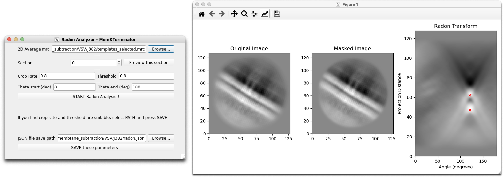
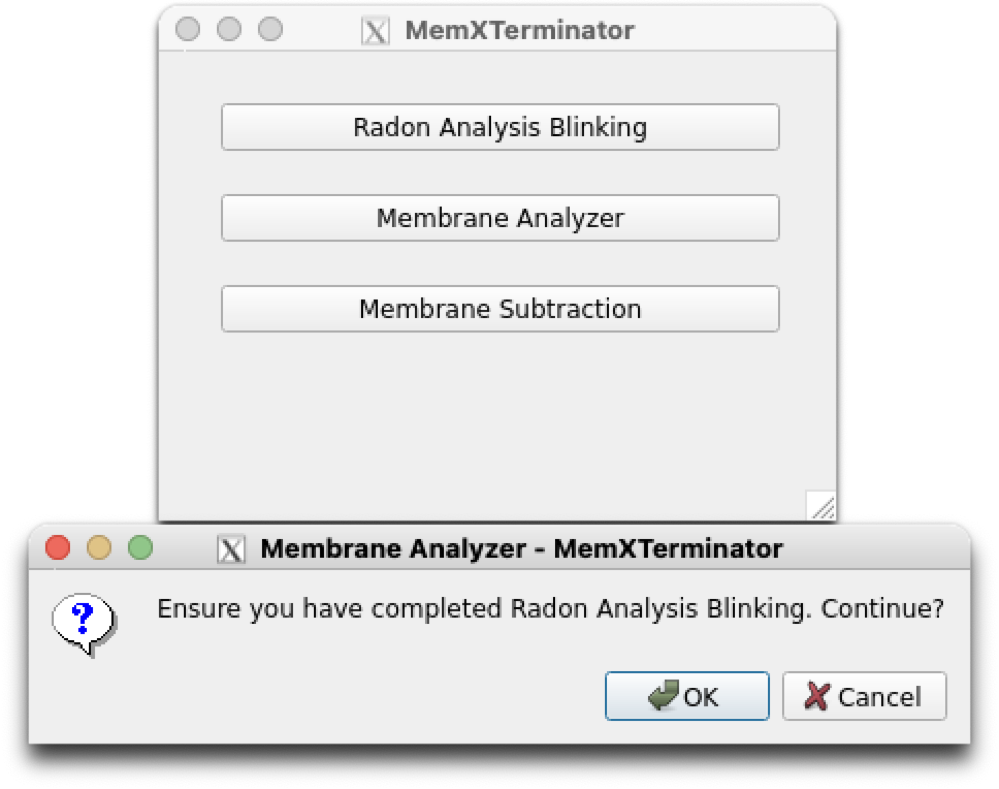
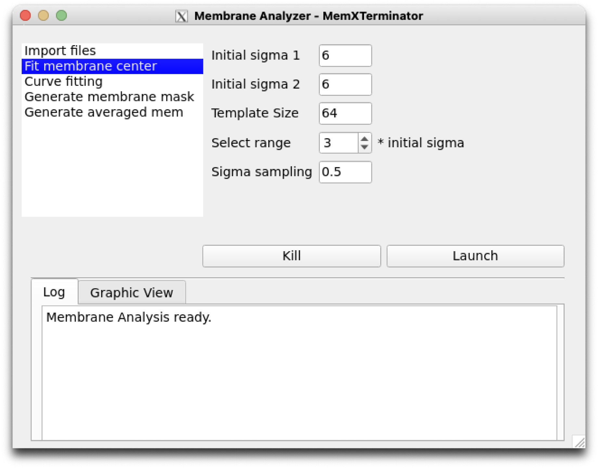

# Membrane Analysis Using Radonfit

## 1 原理及思路

这种方法主要是利用Radon变换、cross-correlation等方法，以**简单的直线和圆弧为模型**，拟合2D average，得到函数表达式，包含膜中心、角度、曲率等信息。适用于**较为简单的生物膜模型**，比如病毒的包膜。

基本思路：

* 使用Radon变换得到生物膜的旋转角度$\theta$以及生物膜bilayer之间的间距$d$；
* 上一步已知了生物膜的旋转角度$\theta$，得到其切线方向，在切线方向上使用simulated membrane作为模版，与原始的2D average进行cross-correlation，得到生物膜的中心位置$(x_c, y_c)$；
* 得到生物膜中心的准确位置$(x_c, y_c)$后，在中心处利用cross-correlation，匹配最佳的膜厚度，即2D gaussian的$\sigma_1$和$\sigma_2$值；
* 根据之前得到的旋转角度$\theta$、中心位置$(x_c, y_c)$、$\sigma_1$和$\sigma_2$值，就相当于知道了一系列函数表达式，在给定的曲率$\kappa$范围内生成一系列simulated membrane以及对应的mask，分别计算与原始的2D average的cross-correlation值，确定最佳的曲率$\kappa$值（此时cross-correlation值最大）。
* 根据上述得到的 $\kappa_{cur}, x_c, y_c, \sigma_1, \sigma_2, d, \theta$ ，就可以得到该类生物膜的函数表达式；根据这些信息对于每一个原始的2D average $f_{2DAverage}(x,y)$，就可以沿着函数进行轨迹平均得到对应的平均后的生物膜 $f_{AveragedMembrane}(x,y)$（简称$f_{AM}$ ）以及对应的蒙版$f_{MembraneMask}(x,y)$（简称$f_{MM}）$。

## 2 具体操作流程

### 2.1 获得templates和对应particles的信息

由于本软件的Radonfit程序在读取particles的信息时，仍然按照Relion的star文件格式，所以需要将cryoSPARC中的particles的信息转换成Relion的star文件格式。未来更新将考虑利用cryosparc-tools直接读取`.cs`文件信息。

1. 到达cryoSPRAC Select 2D Classes对应Job的文件夹下

2. 使用`pyem`的`csparc2star.py`，运行如下命令，将`templates_selected.cs`转成`templates_selected.star`

    对于最新版的`pyem`，运行如下命令：

    ```bash
    csparc2star.py --relion2 templates_selected.cs templates_selected.star
    ```

    如果没有relion2参数，说明您的`pyem`版本较旧，运行如下命令：

    ```bash
    csparc2star.py templates_selected.cs templates_selected.star
    ```

3. 使用`pyem`的`csparc2star.py`，运行如下命令，将`particles_selected.cs`转成`particles_selected.star`：
    对于最新版的`pyem`，运行如下命令：
    ```bash
    csparc2star.py --relion2 particles_selected.cs Jxxx_passthrough_particles_selected.cs particles_selected.star
    ```
    如果没有relion2参数，说明您的`pyem`版本较旧，运行如下命令：
    ```bash
    csparc2star.py --swapxy particles_selected.cs Jxxx_passthrough_particles_selected.cs particles_selected.star
    ```

### 2.2 Radon Analysis Blinking

1. 首先，打开MemXTerminator主程序，进入Radon Analysis Blinking界面：
    <center></center>

2. 选择您想要分析的2D average的mrc文件，输入Section可以选择不同的section进行预览；

3. 填写适合的JSON file save path：点击Browse，选择一个文件夹，然后在该文件夹下输入一个JSON文件名，比如`radon_analysis.json`，这个JSON文件将用于保存Radon Analysis Blinking得到的参数，您可以在下一步Membrane Analysis中使用这个JSON文件；
    > 当您输入一个JSON文件名后，软件会自动创建一个相应的JSON文件，并且在其中填写默认的参数：`crop rate`为0.6，`threshold`为0.7，`theta_start`为0，`theta_end`为180。

3. 选择合适的crop rate和threshold，然后点击START Radon Analysis开始分析；


4. 不断调整Crop rate以及threshold，直到得到合适的Radon Analysis结果。典型的Radon Analysis结果一般符合：在Radon Transform后的图像中选取了两个点，这两点以红色叉表示，其中它们的横坐标相同或者几乎相同（因为一般而言，2D average的bilayer是平行的）、它们的纵坐标间距和bilayer的间距相同或者几乎相同。以下是两种示例：

    <center></center>

    <center></center>

    > 注意：在调整参数时，按道理这些参数经过调整总是能找到一个最优解并且成功分析出结果，如果您发现无论如何都无法分析出合适的结果，那么说明这个2D average可能不适合使用Radonfit进行分析。您需要排除这类的2D average。

5. 当您得到合适的Radon Analysis结果后，点击SAVE these parameters，将参数保存到JSON文件中，这些参数将在下一步Membrane Analysis中使用。

### 2.3 Membrane Analysis

1. 打开MemXTerminator主程序，进入Membrane Analyzer界面：
    <center></center>

2. 点击Import files，依次输入之前得到的`templates_selected.star`、`particles_selected.star`，输入保存Membrane analysis参数结果的路径，再输入之前得到的Radon Analysis结果的JSON文件；记得不用勾选`Generate kappa templates`。
    <center></center>
3. 点击Fit membrane center，设定搜寻膜中心这一步骤的相关参数。默认参数一般情况下都适用。
    <center></center>
    参数解释如下：

    * `Initial sigma 1`：一侧脂单层的高斯分布的$\sigma_1$初始值$\sigma_{init_1}$；
    * `Initial sigma 2`：另一侧脂单层的高斯分布的$\sigma_2$初始值$\sigma_{init_2}$；
    * `Template Size`：进行cross-correlation所用模版的大小，一般情况下不需要改动；
    * `Select range`：搜索两侧$\sigma$值的范围，可以设定$\sigma_{init_1}$及$\sigma_{init_2}$的倍数$x$，范围为$[0.1, x \times \sigma_{init_1})$及$[0.1, x \times \sigma_{init_2})$.
    * `Sigma sampling`：$\sigma$值的采样间隔，一般情况下不需要改动。如果想使得膜厚度匹配得更加精准，可以使用更小的采样间隔，但是这会增加计算量。
4. 点击Curve fitting，设定搜寻膜曲率这一步骤的相关参数。默认参数一般情况下都适用。
    <center></center>
    参数解释如下：

    * `Kappa start`：起始曲率搜索值，默认为-0.1，一般默认即可；
    * `Kappa end`：终止曲率搜索值，默认为0.1，一般默认即可；
    * `Kappa step`：曲率搜索的步长，默认为0.0002，一般默认即可。如果想要增加精度可以适当减少，但是计算量会增加。
5. 点击Generate membrane mask，设置生成蒙版这一步的相关参数。默认参数一般情况下都适用。
    <center></center>
    参数解释如下：

    * `Edge sigma`：边缘模糊的$\sigma$值，默认为3，一般默认即可。

6. 点击Generate averaged mem，设置生成平均后的膜这一步的相关参数。默认参数一般情况下都适用。
    <center></center>
    参数解释如下：

    * `Extra membrane distance`：在沿着曲线平均时，在两侧加额外的范围进行平均，即实际的平均范围为$[-d_{extra}-d_{mem}, d_{mem}+d_{extra}]$，目的是保证膜的完整以及减少边缘的影响。默认为15，一般默认即可。

    * `Edge sigma`：边缘模糊的$\sigma$值，默认为5，一般默认即可。

7. 浏览并修改完参数后，点击Launch即可开始分析。分析完成后，会在您设定的保存路径下生成`mem_analysis.star`文件，该文件包含了所有的分析结果。

## 3 结果

您将会在您设定的保存路径下找到`mem_analysis.star`文件，该文件包含了所有的分析结果。以下是一个典型的`mem_analysis.star`文件的内容：

1. `rln2DAverageimageName`: 2D average的mrc文件名；
2. `rlnAveragedMembraneName`: 2D average的膜平均后的mrc文件名；
3. `rlnMembraneMaskName`: 2D average对应的膜蒙版的mrc文件名；
4. `rlnCenterX`: 膜中心在2D average中的x坐标；
5. `rlnCenterY`: 膜中心在2D average中的y坐标；
6. `rlnAngleTheta`: 膜的旋转角度；
7. `rlnMembraneDistance`: 脂双层之间的间距；
8. `rlnSigma1`: 一侧脂单层的高斯分布的$\sigma_1$值；
9. `rlnSigma2`: 另一侧脂单层的高斯分布的$\sigma_2$值；
10. `rlnCurveKappa`: 膜的曲率。

