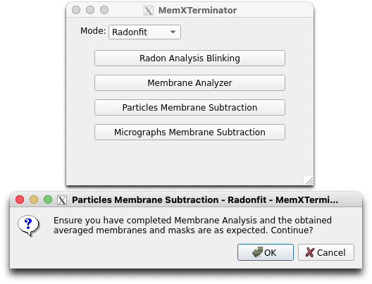
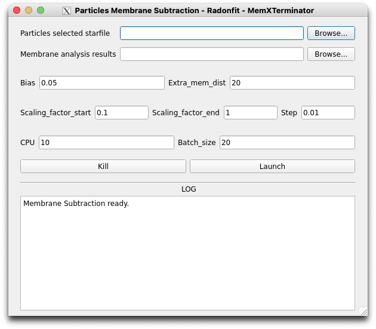

# Particle Membrane Subtraction Using Radonfit

## 1 原理及思路

在经过上一步Membrane Analysis Using Radonfit之后，您已经得到了一个文件`mem_analysis.star`，其中包含了所有的分析结果，包括膜中心坐标、角度、膜的曲率等等。在这一步中，您将使用这些信息，去除所有particles中的膜信号。

基本思路：

* 对每一个particle $F_{RawImage}(x,y)$ （简称 $F_{RI}(x,y)$ ），根据其对应的template $f_{2DAverage}(x,y)$ ，我们都有一个$f_{AveragedMembrane}(x,y)$（简称 $f_{AM}$ ）以及对应的蒙版$f_{MembraneMask}(x,y)$（简称 $f_{MM}$ ）；
* 根据cryoSPARC给出的alignment信息，也就是之前使用的`particles_selected.star`文件，可以得到对于每一个particle的位移量 $(\Delta x, \Delta y)$ 以及旋转角度 $\psi$ ，利用这些信息，将 $f_{AM}$ 和 $f_{MM}$ 进行相应的变换，得到每一个particle的膜信号对应的 $f'_{AM}$ 和 $f'_{MM}$ ；
* 对于每个particle，利用 $f'_{AM}$ 和 $f'_{MM}$ 进行轨迹平均，因此能够得到每个particle对应的膜信号 $F_{AM}(x,y)$ 和蒙版 $F_{MM}(x,y)$ ；
* 对于每个particle，要得到 $F_{SubtractedRawImage}(x,y)$ （简称 $F_{SRI}(x,y)$ ）都有：

$$

F_{SRI}(x,y) = F_{RI}(x,y) \times F_{MM}(x,y) - \lambda \times F_{AM}(x,y)

$$

其中 $\lambda$ 为一个常数，用于控制去膜的强度。确定 $\lambda$ 的方法是：

$$

\lambda = argmin_{\lambda} || F_{RI}(x,y) \times F_{MM}(x,y) - \lambda \times F_{AM}(x,y) ||

$$

## 2 具体操作流程

### 2.1 打开Particles Membrane Subtraction界面

首先，打开MemXTerminator主程序，选择`Radonfit`模式，再选择`Particles Membrane Subtraction`，进入Particles Membrane Subtraction界面：

### 2.2 文件路径填写和参数解释

以下为Particles Membrane Subtraction界面：

在界面中，您需要填入以下文件路径：

* `Particles selected starfile`：您需要选择用于保存所有的particles信息的star文件，通常为`particles_selected.star`；

* `Membrane analysis results`：您需要选择保存所有的membrane analysis信息的star文件，通常为`mem_analysis.star`；

在界面可以选择设置这些参数：

* `Bias`：在去除膜信号过程中，您可以设置一个bias值来手动调整去除膜信号的强度。此时实际的去膜强度 $\lambda' = \lambda + bias$ 。默认为0.05；

* `Extra_mem_dist`：在进行轨迹平均时，您可以设置一个额外的膜厚度，即在膜厚度的基础上，再加上一个额外的膜厚度，以此增加去膜效果的稳定性。默认为15；

* `Scaling_factor_start`以及`Scaling_factor_end`：进行轨迹平均时，scaling factor（即 $\lambda$ ）的搜索范围。默认为0.1和1；

* `Scaling_factor_step`：进行轨迹平均时，scaling factor（即 $\lambda$ ）的搜索步长。默认为0.01。搜索步长越小，scaling factor可能确定的越准确，但是计算时间会增加；

* `CPU`：您可以设置多个CPU进行计算。默认为10。但是如果您的显存较小，建议不要设置太多CPU，否则可能会出现显存不足的情况；

* `Batch_size`：您可以设置并行处理多少个particle stacks。默认为20，即CPU数量的2倍。设置为CPU数量的倍数比较好。如果您的显存较小，不建议设置太大的Batch size。

设置完合适参数后，点击`Launch`即可开始去除膜信号。

## 3 结果

运行结束后，您将在您extract出的particles的文件夹旁边得到一个subtracted文件夹，即：

    Jxxx
    ├── extract
    ├── subtracted

在subtracted文件夹中，保存有所有去除膜信号后的particles的mrc文件。您可以使用cryoSPARC进行下一步的处理，或者将particles重新贴回micrographs中进行下一步处理。